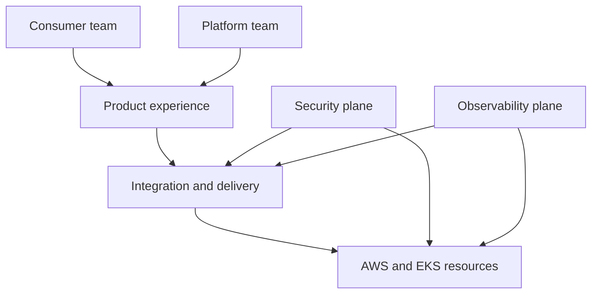
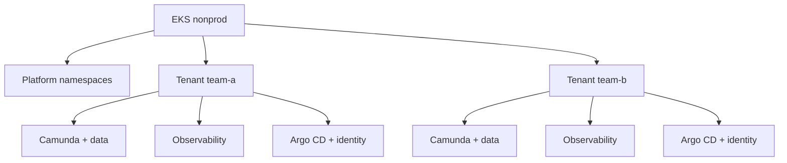
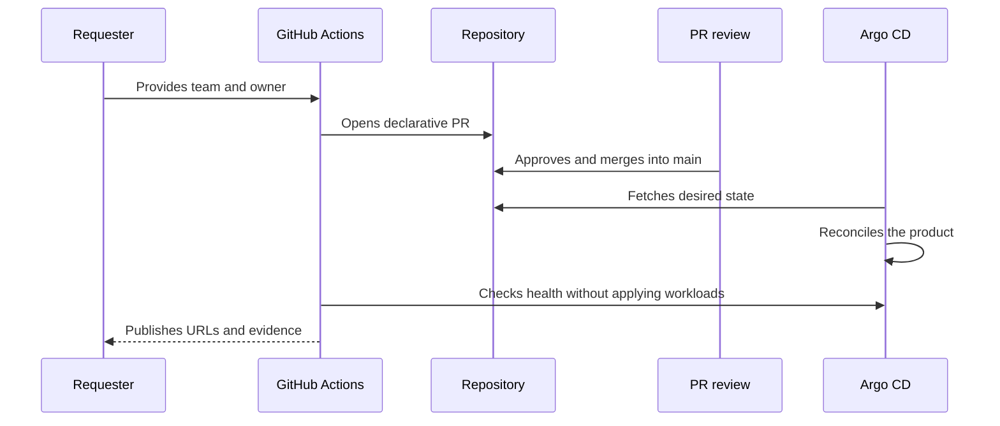
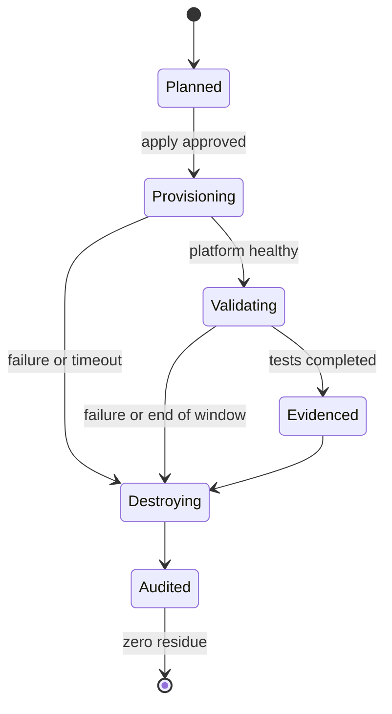

# Camunda Ephemeral Platform and Observability — Architecture and Backlog Document

**Version:** 0.1 — approved baseline
**Status:** approved to guide spikes and implementation
**Initial target environment:** AWS / EKS / `nonprod`
**Domain:** `projetodevops.com.br`
**Owner:** platform engineering
**Last updated:** September 21, 2026
**Approval:** explicit acceptance by the owner recorded on September 21, 2026

> This document is the approved architectural baseline and the project's source of truth. It guides spikes, code, tests, operation and documentation. Later changes must go through a pull request, with justification, impact analysis and new approval.

---

## 1. Executive summary

This project will build, exercise and destroy an internal ephemeral platform capable of delivering to consumer teams a complete, isolated installation of Camunda 8 Self-Managed, accompanied from birth by an equally isolated observability stack. The consumer requests the product and receives URLs, credentials and usage guidance; decisions about infrastructure, security, telemetry, operation and cost remain the responsibility of platform engineering.

The first delivery will use AWS and Amazon EKS. The architecture will be portable at the level of platform experience and contracts, but will not pretend cloud resources are identical. A future GCP/GKE implementation must preserve the product contract and replace provider-specific adapters.

The lab will have a shared `nonprod` cluster and two validation tenants, `team-a` and `team-b`. Each tenant will have its own namespaces, Camunda, data dependencies, observability stack, identity and Argo CD instance. The platform team will have platform components and observability, an administrative Argo CD instance and administrative access to the cluster. Consumer teams will not have Kubernetes access.

The cycle will be mandatorily ephemeral: provision, validate and destroy. The initial cost target is **US$ 3 to US$ 8 per run**, with an alert at US$ 10 and a block before an estimate above US$ 20. Time will not be optimized at the expense of cost or predictability.

## 2. Context and problem

Product teams should not need to understand VPC, EKS, Helm, controllers, collectors, policies or telemetry backends to start modeling and running BPMN processes. The problem to solve is not just provisioning software; it is offering a repeatable, secure, observable consumption experience with low cognitive effort.

The lab also needs to let its owner take on two perspectives:

1. **Platform engineer:** creates and operates the shared capability, defines standards, controls access and costs, and observes the health of the entire platform.
2. **Consumer:** receives the ready-made product, uses Camunda, checks telemetry within their own scope and performs simple GitOps operations without seeing other tenants.

This duality will be explicitly tested. It is not enough for resources to be `Ready`; the delivered experience needs to work with the permissions and abstractions expected by each persona.

## 3. Product hypothesis

> If platform engineering offers Camunda and observability as a pre-configured product, accessible through a declarative flow and protected by guardrails, then a consumer team will be able to start its BPMN work without knowing the provisioning details and without interfering with other teams.

### 3.1 Value proposition

- repeatable provisioning through a pipeline;
- a complete product, with telemetry, dashboards and minimal alerts from the first use;
- tenant isolation within a shared cluster;
- simple access through predictable URLs;
- Git as the source of truth;
- security and cost built into the standard path;
- full, verifiable destruction at the end of the lab.

### 3.2 Lab success metrics

| Indicator | Initial target |
|---|---:|
| Concurrent validated tenants | 2 |
| Maximum time reserved for provisioning | 90 minutes |
| Expected manual validation window | up to 20 minutes |
| Environment security TTL | 3 hours |
| Desired cost range per run | US$ 3–8 |
| Cost alert | US$ 10 |
| Preventive block by estimate | above US$ 20 |
| Improper cross-tenant access | zero |
| Residual billable resources after destroy | zero |
| Mandatory telemetry | metrics, logs and traces |

The financial targets are hypotheses to be validated before the first `apply`. They are not a price promise, since prices, duration, instance types and consumption vary.

## 4. Architectural principles

1. **Platform as a product:** start from consumer needs and measure the delivered experience.
2. **Golden path, not a toolbox:** the consumer chooses what they need; the platform decides how to deliver it.
3. **Observability by default:** no product is born without essential telemetry, dashboards and alerts.
4. **Real GitOps:** Git describes the desired state and controllers pull and reconcile the cluster.
5. **Infrastructure as code:** cloud resources and minimal bootstrap are declarative, versioned and testable.
6. **Secure by default:** least privilege, verifiable identity, secrets outside Git, segmentation and automated policies.
7. **FinOps by design:** cost is an architectural requirement, not an after-the-fact report.
8. **Explicit isolation:** namespaces alone are not enough; identity, RBAC, network, data, GitOps and telemetry make up the boundary.
9. **Portability with honesty:** standardize contracts and interfaces, using cloud-specific adapters.
10. **Buy or reuse before building:** prefer maintained and supported modules, charts and operators.
11. **Intentional simplicity:** every component must justify its operational and educational cost.
12. **Verifiable ephemerality:** creating from scratch and removing everything is part of the product.
13. **Evidence before opinion:** technical behavior must be proven in official documentation or a reproducible spike.
14. **No double reconciliation:** every Kubernetes resource will have a single declarative owner.

## 5. Scope

### 5.1 Included in the first delivery

- a pre-existing AWS account and default region `us-east-1`;
- an ephemeral `nonprod` EKS cluster;
- two test tenants: `team-a` and `team-b`;
- one Camunda 8 Self-Managed installation per tenant;
- all functional Camunda components covered by the chosen chart, subject to the official compatibility matrix;
- dedicated Elasticsearch per Camunda installation;
- dedicated PostgreSQL and Keycloak when required by the validated chart design;
- dedicated observability per tenant: OpenTelemetry, Prometheus/Alertmanager, OpenSearch/OpenSearch Dashboards, Jaeger and Perses;
- observability independent from the platform;
- one Argo CD instance per tenant and one administrative platform Argo CD instance;
- external URLs for the necessary interfaces;
- automated DNS on Cloudflare;
- TLS and ingress routing;
- alerts on separate Discord channels;
- a sample BPMN process and an instrumented worker;
- isolation, telemetry, alerting, GitOps, security, cost and destruction tests;
- minimal runbooks;
- GitHub Actions, OIDC with AWS and branch protection;
- Kyverno, Trivy, SBOM and guardrails defined in this document.

### 5.2 Out of initial scope

- real high availability;
- contractual production SLA/SLO;
- data retention, backup or recovery;
- disaster recovery;
- multi-region or a second cluster;
- Spot Instances in the first version;
- NAT Gateway and private subnets for nodes;
- a dedicated developer portal, such as Backstage;
- a provisioned CDE;
- GCP/GKE deployment;
- automated creation of Discord server, channels or webhooks;
- Kubernetes access for consumer teams;
- production or commercial use of Camunda;
- volume retention after destruction.

These items may join the roadmap, but will not be introduced merely to make the lab appear more complete.

## 6. Licensing and usage restriction

The conceptual target version is Camunda 8.9 Self-Managed. The binaries of the selected components will be used exclusively under the **Camunda Self-Managed Non-Production License**. The environment will be personal, temporary, non-production and non-commercial.

Before implementation, the following will be verified:

- current license terms;
- availability of images and charts;
- per-component technical license requirements;
- supported version and dependency matrix.

This architecture cannot be promoted to production merely by flipping a variable. The `full-observability-production` profile will remain only a conceptual evolution until licensing, HA, security, continuity, support and costs are redesigned and approved.

## 7. Personas, responsibilities and access

### 7.1 Platform engineer

Responsible for infrastructure, cluster, controllers, policies, identity, exposure, platform telemetry, capacity, costs, advanced troubleshooting and lifecycle.

Capabilities:

- administrative EKS access via terminal and `k9s`;
- access to the platform Argo CD instance;
- visibility over all namespaces and tenants;
- administrative access to platform interfaces and observability;
- ability to investigate all components;
- execution of authorized creation and destruction pipelines.

### 7.2 Consumer team

Responsible for using the product, creating and running BPMN, checking telemetry, responding to alerts within their own scope and requesting support when needed.

Capabilities:

- access authorized Camunda interfaces;
- access their own tenant's observability interfaces;
- view applications in their own Argo CD;
- run `sync` only on permitted applications;
- consult runbooks and run the functional example.

Restrictions:

- no access to the cluster, Kubernetes API or `k9s`;
- no read access to other tenants' namespaces;
- no changes to repository, destination, project, RBAC or global Argo CD configuration;
- no access to another tenant's observability, identity, data or secrets.

### 7.3 Summary matrix

| Capability | Platform | Consumer |
|---|:---:|:---:|
| Cluster and all namespaces | Administer | No access |
| Platform Argo CD | Administer | No access |
| Tenant Argo CD | Administer | View and sync |
| Tenant Camunda | Administer/support | Use |
| Tenant observability | Administer/support | View |
| Platform observability | Administer | No access |
| Secrets and technical credentials | Administer via controlled flow | No direct access |
| Destroy pipeline | Execute with protection | No access |

## 8. Consumer experience

### 8.1 Product intake

The initial request will require few mandatory inputs:

| Input | Example | Rule |
|---|---|---|
| `team_name` | `team-a` | validated DNS/Kubernetes slug, unique and immutable within the cycle |
| `owner` | GitHub user or team | required for traceability |
| `product_profile` | `full-observability-nonprod` | closed catalog; no CPU/memory tuning |

Cloud, region, capacity, components, charts, storage and policies will not be consumer choices in the first delivery.

### 8.2 Product output

At the end of the flow, the consumer will receive:

- request status;
- valid URLs;
- authentication method;
- permission scope;
- BPMN/worker example;
- available dashboards and alerts;
- first-access runbook;
- Argo CD sync runbook;
- Discord alert channel;
- support instructions and lab limitations.

### 8.3 Naming and URL convention

The team identifier avoids collisions between environments and consumers. The pattern will be:

`<component>-<team>.<domain>`

Examples:

- `operate-team-a.projetodevops.com.br`
- `tasklist-team-a.projetodevops.com.br`
- `identity-team-a.projetodevops.com.br`
- `modeler-team-a.projetodevops.com.br`
- `optimize-team-a.projetodevops.com.br`
- `argocd-team-a.projetodevops.com.br`
- `prometheus-team-a.projetodevops.com.br`
- `perses-team-a.projetodevops.com.br`
- `jaeger-team-a.projetodevops.com.br`
- `opensearch-team-a.projetodevops.com.br`

The final list will be derived from the interfaces officially supported by the chart and from security review. APIs will only be exposed when a functional flow requires external access. Elasticsearch, PostgreSQL, internal collectors and administrative endpoints will not be published without proven need.

## 9. Reference architecture

The solution adapts five planes from the reference studied.

| Plane | Responsibility | Initial components |
|---|---|---|
| Developer experience/control | Request, documentation and consumption | GitHub Actions, documentation, URLs and runbooks |
| Integration and delivery | Source of truth, validation and reconciliation | GitHub, Actions, Terraform, Helm and Argo CD |
| Resources | Compute, network, data and registry | AWS, VPC, EKS, EBS and ECR when needed |
| Security | Identity, secrets, policies and supply chain | IAM/OIDC, EKS Access Entries, Pod Identity, Keycloak, Secrets Manager, ESO, Kyverno and Trivy |
| Observability | Telemetry, visualization, alerting, incident and cost | OTel, Prometheus, Alertmanager, OpenSearch, Jaeger, Perses, Discord and cost estimation |

## 10. AWS and EKS topology

### 10.1 Initial decision

- default region `us-east-1`, revalidated for price and availability before execution;
- one ephemeral VPC;
- two public subnets across two availability zones for Application Load Balancer compatibility;
- nodes in a single zone to reduce dispersion and cost;
- no private subnets and no NAT Gateway;
- nodes with a public address for egress, but no SSH and no public inbound rule;
- public EKS endpoint restricted to known runner/operator CIDRs whenever operationally possible;
- one homogeneous, On-Demand managed node group;
- Cluster Autoscaler with a calculated baseline and only one additional node as the initial limit;
- ephemeral, encrypted EBS volumes with no retention policy after the lab.

Two public subnets do not represent a high-availability decision for the lab; they satisfy the ALB's topology requirement. Workloads will carry no promise of zonal fault tolerance.

### 10.2 Sizing

The instance type will not be chosen by intuition. The mandatory process will be:

1. pin candidate chart versions;
2. render manifests for the platform, `team-a` and `team-b`;
3. sum CPU, memory and storage requests;
4. add system and DaemonSet overhead;
5. apply an initial 20% margin;
6. map the result to compatible instance types;
7. estimate cost over total time and compare alternatives;
8. run a reduced spike and review the calculation.

The same node type will be used across the entire node group. Future profiles will differentiate capacity mainly by quantity, keeping the experience uniform.

## 11. Multi-tenant isolation

Each request creates an independent set of resources in the shared cluster. The namespace is the primary organizational unit, but isolation results from combined controls.

### 11.1 Namespaces

Platform namespaces:

- `platform-system`
- `platform-argocd`
- `platform-security`
- `platform-observability`
- `platform-ingress`

Per tenant `<team>`:

- `<team>-argocd`
- `<team>-identity`
- `<team>-camunda`
- `<team>-observability`

### 11.2 Mandatory controls

- standardized labels for tenant, owner, environment, product and cost center;
- least-privilege RBAC and ServiceAccounts;
- Argo CD and AppProjects with allowed destinations and repositories;
- `default-deny` NetworkPolicies with explicit allowlists;
- separate secrets and keys;
- independent databases and indices;
- collectors/gateways with deterministic routing;
- exclusive ingress hosts;
- quotas and LimitRanges evaluated after sizing;
- Kyverno policies to prevent drift;
- negative cross-tenant access tests.

## 12. Camunda per tenant

Each tenant will have a complete, independent Camunda installation. There will be no Elasticsearch sharing between Camunda and observability, nor between tenants.

### 12.1 Intended functional components

- Zeebe;
- Operate;
- Tasklist;
- Optimize;
- Identity;
- Connectors;
- Web Modeler and its supported dependencies;
- Console, if available and applicable to the chosen Self-Managed mode;
- Elasticsearch dedicated to Camunda;
- dedicated PostgreSQL when required;
- Keycloak dedicated to the tenant scope.

"All components" means all components distributed and supported in the officially selected composition, not legacy, incompatible or unavailable components under the installation's terms.

### 12.2 Minimal lab profile

Production recommendations will not be mechanically reproduced. Replicas may be reduced to one per component when supported. Zeebe, Elasticsearch and other distributed systems will be configured at the smallest validated functional profile. The goal is to demonstrate integration and operation, not resilience.

Any override below the supported minimum must:

- appear as a lab deviation;
- be proven in a spike;
- not be presented as a production recommendation;
- fail fast if the chosen version does not accept it.

## 13. Observability product

Observability will not be an optional Camunda feature. Each tenant will receive an independent stack composed of:

| Signal/capability | Component |
|---|---|
| Instrumentation, collection, processing and routing | OpenTelemetry |
| Metrics and rules | Prometheus |
| Alert evaluation and routing | Alertmanager |
| Logs | OpenSearch |
| Log exploration | OpenSearch Dashboards |
| Traces | Jaeger |
| Dashboards as code | Perses |
| Notifications | Discord |

### 13.1 OpenTelemetry collectors

A hybrid design will be adopted, subject to a spike:

- a `DaemonSet` Collector, managed by the platform, for node-associated signals and container logs;
- a dedicated per-tenant gateway to receive OTLP from applications and apply tenant-level processing and export;
- filters based on trusted attributes and Kubernetes metadata;
- no exclusive reliance on a client-supplied tenant attribute;
- consciously configured memory, batching, retry and backpressure.

The `DaemonSet` does not replace the gateway. It brings collection closer to the workload; the gateway establishes the logical boundary and per-tenant routing.

### 13.2 Semantic conventions

Resources must carry, when applicable:

- `service.name`
- `service.namespace`
- `service.version`
- `deployment.environment.name`
- Kubernetes attributes detected by the collector;
- a tenant identifier derived from a trusted context.

The BPMN/worker example must propagate context to enable correlation between execution, trace and logs whenever the Camunda APIs and instrumentation support it.

### 13.3 Platform observability

The platform stack is independent from tenant stacks and covers:

- nodes, pods, workloads and accessible control plane;
- cluster health and capacity;
- autoscaler and pending pods;
- ingress, DNS, secrets, policy and GitOps controllers;
- platform Argo CD and tenant instances;
- observability collectors and backends;
- pipeline and lifecycle failures;
- cost signals and orphaned resources when available.

It will not be used as a shortcut to mix tenant data. The platform team may have administrative access to team stacks when required for support.

## 14. Minimal dashboards and alerts

Pre-configured means offering the smallest set that enables operation and learning, not hundreds of panels and alarms.

### 14.1 Tenant dashboards

1. **Camunda overview:** availability, process/job throughput, failures, incidents and relevant latency.
2. **Tenant runtime:** CPU, memory, restarts, pod state, PVC and saturation.
3. **Example telemetry:** RED — rate, errors and duration — for the worker/application.
4. **Observability pipeline:** OTel ingestion, drops, queues and export errors.

### 14.2 Platform dashboards

1. **Cluster overview:** capacity, requests, usage, nodes and pending pods.
2. **Platform services:** Argo CD, ingress, ExternalDNS, ESO, Kyverno and autoscaler.
3. **Observability health:** collectors, Prometheus, OpenSearch, Jaeger and Perses.
4. **Tenant fleet:** aggregated health of `team-a` and `team-b`, without replacing their own interfaces.

### 14.3 Initial alerts

- essential interface unavailable;
- pod in crash loop or abnormal restart;
- pod pending due to capacity;
- relevant CPU/memory pressure;
- volume near its limit;
- OTel ingestion or export failure;
- Argo CD reconciliation error or queue;
- Argo CD application `OutOfSync`/`Degraded` for a significant period;
- Camunda incidents/failures detectable via official metrics;
- loss of the single node;
- DNS/certificate flow failure when observable.

Tenant alerts go to their own Discord channel. Critical alerts are also duplicated to the platform channel. The platform receives its alerts directly.

Channels and webhooks will be created manually: `platform`, `team-a` and `team-b`. Webhook URLs will be stored as secrets and never versioned.

## 15. GitOps and resource ownership

### 15.1 Ownership rule

| Layer | Declarative owner |
|---|---|
| Account/prerequisites and state backend | controlled bootstrap |
| VPC, EKS, node group, IAM and AWS integrations | Terraform |
| Minimal Argo CD Operator bootstrap and GitOps root | Terraform/Helm only in the initial phase |
| Argo CD instances and Kubernetes workloads | Argo CD from Git |
| Tenant applications | tenant Argo CD |
| Shared components and policies | platform Argo CD |

After bootstrap, Terraform will not update the same resources that Argo CD reconciles. The pipeline will not directly apply workload manifests to the cluster.

### 15.2 Argo CD instances

The Argo CD Operator will be installed once and will manage:

- a `platform` instance in `platform-argocd`;
- an instance in `team-a-argocd`;
- an instance in `team-b-argocd`.

The platform instance reconciles shared components and the declarative provisioning of products/tenants. It provides an aggregated view and links to the child instances, but does not reconcile the same objects assigned to them.

Tenant instances operate only within authorized namespaces and projects. Consumer users can view and sync, but cannot change source, destination, project, cluster, repository or administrative configuration.

### 15.3 Flow

## 16. Repositories and GitHub governance

### 16.1 Repositories

1. **`platform-engineering-lab`**: Terraform, GitOps configuration, Helm values/overrides, policies, dashboards, alerts, documentation, tests and platform workflows.
2. **`camunda-sample-worker`**: sample BPMN, instrumented worker, tests and the build/security pipeline for the demo application.

### 16.2 Protections

The `main` branch will be the source of truth and will accept changes only through pull requests. The repository must require:

- at least one approval, even though the lab uses a single person and the review is exercised in a controlled way;
- required checks;
- resolved conversations;
- an up-to-date branch when necessary;
- prohibition of force push and deletion;
- `CODEOWNERS` for sensitive areas;
- protected GitHub environments for `apply` and `destroy`;
- minimal `GITHUB_TOKEN` permissions;
- actions pinned by immutable version/commit according to the defined policy;
- AWS authentication via OIDC, with no permanent access keys.

### 16.3 Pull request checks

- Terraform formatting and validation;
- module linting and documentation;
- safe `terraform plan` and cost estimate;
- Helm rendering;
- Kubernetes schema validation;
- YAML linting;
- policy validation;
- secret detection;
- Trivy for IaC, filesystem and applicable images;
- worker SBOM generation;
- unit and contract tests;
- link/documentation verification when feasible.

## 17. Identity and access

### 17.1 Universal principle

Every access will have a verifiable identity, human or machine. Authentication does not imply authorization; specific policies will define what each identity can do.

### 17.2 Humans

- platform engineer: pre-configured/federated AWS, administrative EKS Access Entry and interface authentication;
- consumer: authentication within their own tenant's identity domain;
- mandatory MFA/TOTP for human users created in the lab;
- separate accounts per role; no shared account as the primary path.

### 17.3 Machines

- GitHub Actions → AWS via OIDC and short-lived roles;
- workloads → AWS via EKS Pod Identity when supported by the addon/component;
- applications → internal backends with minimal-scope ServiceAccounts and secrets;
- ESO → AWS Secrets Manager with permission limited to the necessary paths.

Bootstrap credentials may be generated automatically, stored in a secret manager and presented only through a protected flow. No secret will live in values files, versioned Terraform variables, public outputs or logs.

## 18. Security and Policy as Code

### 18.1 Layers

- least-privilege IAM;
- specific Security Groups for control plane, nodes and ALB;
- no open administrative node port;
- NetworkPolicies between namespaces and components;
- TLS on external ingress;
- external secrets;
- Kubernetes and Argo CD RBAC;
- image and configuration validation;
- admission control policies;
- change logs and evidence.

### 18.2 Security Groups

Security Groups are mandatory even with NetworkPolicies. They act at the AWS network boundary; NetworkPolicies control Kubernetes traffic. The minimal design will include:

- control plane/cluster SG managed according to EKS guidance;
- node SG allowing only the necessary flows between nodes, control plane and egress;
- ALB SG allowing public `443` and `80` only if used for redirection;
- ALB reaching only the necessary ports/targets;
- no SSH and no broad ingress on nodes.

### 18.3 Kyverno

Policies will be promoted gradually: `Audit` during bootstrap and observation, then `Enforce` for proven controls. Prefer current APIs and CEL policies when mature for the case.

Candidate initial policies:

- require ownership, tenant, environment and product labels;
- restrict registries and mutable tags;
- prohibit privileged containers and host namespaces;
- require `runAsNonRoot` and seccomp when compatible;
- prevent unauthorized `hostPath`;
- require requests and limits after sizing;
- require a baseline NetworkPolicy per namespace;
- prevent `LoadBalancer` outside the ingress standard;
- validate hosts within the allowed domain;
- block namespaces/resources outside the GitOps scope.

Necessary exceptions for third-party charts will be documented, minimal, versioned and justified. Global control will not be silently reduced to accommodate a chart.

### 18.4 Supply chain

The in-house worker will have a digest-pinned image, Trivy scanning and an SBOM. Third-party charts and images will be pinned to compatible, evaluated versions, but the lab will not promise artifact signing that its vendors do not offer. Critical CVEs will have a block policy or a documented exception based on exploitability and fix availability.

## 19. Network, ingress, DNS and TLS

An AWS Load Balancer Controller will provide a shared ALB via explicit Ingress grouping, reducing cost. Logical separation will happen through hostnames and rules, not one load balancer per interface.

ExternalDNS will manage only records with TXT ownership and a filter for the `projetodevops.com.br` domain. The Cloudflare token will have the smallest possible scope for the zone. In the first version, records will stay in **DNS only** mode until HTTP, WebSocket and gRPC are validated end to end; Cloudflare proxying will be a deliberate later evolution.

TLS will use a certificate compatible with the hostname set and will be automated by the mechanism chosen after a spike. The decision between ACM and cert-manager must consider ALB termination, wildcard, DNS-01 and operational cost. Only `443` will be the normal path; `80`, if enabled, will redirect to HTTPS.

gRPC access to Camunda will be the subject of a specific spike, since protocol, health checks, annotations and TLS termination need to be validated against the chart version and the AWS Load Balancer Controller.

## 20. Secrets

AWS Secrets Manager will be the secrets backend for the first delivery. External Secrets Operator will materialize only the necessary secrets in the corresponding namespaces.

The following will be stored, when applicable:

- Discord webhook per destination;
- Cloudflare token;
- initial interface credentials;
- secrets for internal integrations that cannot be generated/rotated another way.

Rules:

- never version a sensitive value;
- avoid returning secrets in Terraform outputs;
- mask pipeline logs;
- isolate paths and IAM per component/tenant;
- remove lab-created secrets during destroy;
- distinguish external prerequisites, such as owner credentials, from ephemeral resources.

## 21. FinOps

### 21.1 Guardrails

- estimate before `apply`;
- mandatory tags: project, environment, owner, run and expiration;
- account budget/alert when available;
- publish the estimated cost in the PR/pipeline;
- protected confirmation when the estimate exceeds US$ 10;
- automatic block above US$ 20, unless an approved document change states otherwise;
- 3-hour TTL and emergency cleanup workflow;
- post-destroy audit of ALB, EBS, snapshots, Elastic IP, ENI, EKS and other billable resources;
- the state bucket removed last when it is itself part of the lab.

### 21.2 Main cost drivers

- EKS control plane hourly rate;
- node EC2 costs;
- ALB;
- EBS and accidental snapshots;
- traffic/NAT — avoided in the initial design;
- Secrets Manager;
- logs and external calls;
- accidental retention after failures.

Cost per run will be measured and recorded, allowing the profile to be recalibrated without exposing capacity to the consumer.

## 22. Pipelines and lifecycle

### 22.1 Planned workflows

| Workflow | Purpose | Protection |
|---|---|---|
| `pr-checks` | validate code, manifests, security and cost | automatic |
| `request-product` | generate a PR for a tenant/profile | manual, validated inputs |
| `provision-foundation` | create cloud/EKS/bootstrap | protected environment |
| `validate-platform` | prove the shared layer | automatic after health check |
| `validate-tenants` | prove the product and isolation | automatic + evidence |
| `destroy-lab` | remove GitOps and infrastructure | protected environment, always executable |
| `emergency-cleanup` | remove residue after failure | manual and auditable |

Apply and destroy are separate workflows to reduce coupling and ensure cleanup can be re-run independently. The full experience may orchestrate them in a higher-level run, but each phase remains recoverable.

### 22.2 Creation order

1. validate prerequisites, license, budget and inputs;
2. create state backend/locks per the final design;
3. create network, IAM, EKS and node group;
4. install minimal bootstrap and the Argo CD Operator;
5. point the GitOps root to `main`;
6. reconcile platform components;
7. validate platform health;
8. reconcile tenants;
9. validate URLs, identity, Camunda, observability and isolation;
10. run the BPMN demonstration and a controlled failure scenario;
11. collect evidence;
12. destroy.

### 22.3 Destruction order

1. start even if earlier validations failed;
2. declaratively remove tenants and Argo CD applications;
3. wait for finalizers and deletion of ingresses, load balancer and volumes;
4. remove shared GitOps components;
5. confirm controllers completed external deletions;
6. remove bootstrap, nodes, EKS, network and IAM via Terraform;
7. remove secrets and expected ephemeral artifacts;
8. audit residual resources and cost;
9. remove the ephemeral backend last, preserving non-sensitive evidence outside it.

## 23. Tests and evidence

### 23.1 Validation pyramid

1. **Static:** lint, schema, policies, security and documentation.
2. **Rendering:** Helm templates and per-profile composition.
3. **Plans:** Terraform and cost.
4. **Integration:** controllers, DNS, TLS, identity and telemetry.
5. **End-to-end:** Camunda consumption and cross-tenant segregation.
6. **Destruction:** absence of resources and residual billing.

### 23.2 Mandatory scenarios

- `team-a` cannot see `team-b`'s applications, interfaces, data or telemetry;
- `team-b` cannot see `team-a`'s resources;
- the platform sees and supports both;
- the consumer views and syncs only the applications permitted in their own Argo CD;
- an attempted administrative action by the consumer is denied;
- the sample BPMN is deployed and executed;
- the worker successfully processes one job and fails a controlled scenario;
- metrics, logs and traces appear in the correct tenant;
- dashboards load data;
- an alert reaches the correct channel;
- a critical tenant alert also reaches the platform channel;
- controlled Git drift is detected/reconciled according to the rule;
- an invalid policy is audited or blocked according to the stage;
- the autoscaler reacts to a pending pod in the planned scenario;
- destroy removes all billable resources created.

### 23.3 Evidence

Each run will produce a non-sensitive summary with:

- commit and effective versions;
- start/end and duration of phases;
- estimated and observed cost, when available;
- list of tested endpoints, without tokens;
- test results;
- screenshots or exports strictly necessary;
- alerts received;
- residual-resource audit result.

## 24. Controlled chaos engineering

The lab will include only small, reversible failures with a clear hypothesis. The goal is to demonstrate detection and response, not to cause randomness.

Candidate scenarios:

1. terminate a worker pod or a stateless component and observe recovery;
2. generate an intentional worker error to produce logs, a trace and an alert;
3. create short-lived load that causes a pending pod and an autoscaler reaction;
4. temporarily suspend an OTel export path to observe queueing/drop and recovery.

Each experiment will have a steady state, hypothesis, blast radius, duration, rollback and evidence. Single-node Elasticsearch/Zeebe failures will be handled with caution, since they may invalidate the environment instead of teaching real recovery.

## 25. Operation and runbooks

Minimal runbooks:

- consumer first access;
- create, deploy and run the sample BPMN;
- locate metrics, logs and traces;
- interpret initial dashboards and alerts;
- view and sync in the tenant Argo CD;
- `OutOfSync` or `Degraded` application;
- pending pod/insufficient capacity;
- DNS/TLS/ingress failure;
- collector/exporter failure;
- alert not delivered to Discord;
- administrative access by the platform team via `k9s`;
- safe execution of destroy;
- residue cleanup and cost check.

Every runbook will contain symptoms, scope, prerequisites, steps, evidence of success, rollback/escalation and actions forbidden to the consumer.

## 26. Decisions on the eleven courses

Not every course becomes a tool. Each one contributes according to product need.

| Course/topic | Application in the project | Intensity |
|---|---|---|
| Intro to Platform Engineering | product, consumer, golden paths and reduced cognitive load | central |
| DevOps Modernization | flow, feedback and incremental evolution | complementary |
| Infrastructure as Code | abstractions, modules, tests, lifecycle and governance | central |
| Kubernetes Lifecycle | bootstrap, operation, sizing, autoscaling and destroy | central |
| Observability | dual perspective, OTel, signals, dashboards and alerts | central |
| CDEs | reproducible environment principles | indirect; no initial CDE |
| Vulnerability Management | scans, SBOM, policies and secure by default | important |
| GitOps | source of truth, pull/reconciliation, drift and ownership | central |
| Infrastructure Identity | human/machine identity, short-lived and least privilege | important |
| AI in Platform Engineering | responsible use as support, never technical authority | indirect |
| Developer Portals | contract, catalog and self-service | conceptual; portal deferred |

Course material is secondary educational reference. It will not be copied extensively nor used to replace official documentation.

## 27. Implementation backlog

### EP00 — Governance and project foundations (P0)

- define the structure of the two repositories;
- configure branch protection, CODEOWNERS and environments;
- record conventions, labels, status and versioning;
- create a matrix of official sources;
- define the evidence and changelog format.

**Acceptance:** no change reaches `main` without a PR and checks; documentation identifies owner and status.

### EP01 — Feasibility spikes (P0)

1. rendering and sizing of all charts;
2. full Camunda 8.9 in the minimal profile;
3. EKS endpoint and runner connectivity;
4. ALB with required HTTP/WebSocket/gRPC;
5. multiple Argo CD instances and real isolation;
6. ordered destruction with no residue.

**Acceptance:** each spike records hypothesis, procedure, result, evidence and decision; failure may change this document before the main implementation.

### EP02 — FinOps and prerequisites (P0)

- inventory external prerequisites;
- model cost and thresholds;
- implement tags, TTL and gates;
- prepare residue audit.

**Acceptance:** a run above the limit is blocked and resources are traceable.

### EP03 — Base AWS IaC (P0)

- state backend and locking;
- VPC/subnets/routes;
- IAM/OIDC;
- EKS, access entries, addons and managed node group;
- minimal outputs for bootstrap.

**Acceptance:** infrastructure is born through the pipeline, with no permanent AWS credential and with proven administrative access.

### EP04 — GitOps bootstrap (P0)

- install the operator;
- create the platform Argo CD instance;
- register the GitOps root on `main`;
- transfer workload ownership to Argo CD.

**Acceptance:** Git changes reconcile and the pipeline does not apply workloads directly.

### EP05 — Shared services (P0)

- ingress/ALB;
- Cloudflare DNS;
- TLS;
- ESO;
- Kyverno;
- autoscaler;
- necessary metrics/integration components.

**Acceptance:** controllers healthy, observable and reconciled by Argo CD.

### EP06 — Identity and security (P0)

- human and machine flows;
- Pod Identity;
- Kubernetes/Argo RBAC;
- policies and exceptions;
- network policies;
- scans and SBOM.

**Acceptance:** positive and negative tests confirm access boundaries.

### EP07 — Platform observability (P0)

- collectors;
- backends and dashboards;
- alerts and the `platform` Discord channel;
- controller and cluster coverage.

**Acceptance:** a controlled platform failure is detected, investigable and notified.

### EP08 — Product/tenant template (P0)

- input schema;
- declarative generation per team;
- namespaces, labels, quotas and policies;
- URLs and secrets;
- tenant Argo CD instance and identity.

**Acceptance:** two tenants are generated with no collisions and no manual cluster editing.

### EP09 — Camunda per tenant (P0)

- minimal supported values;
- independent data dependencies;
- necessary interfaces and APIs;
- health checks and telemetry.

**Acceptance:** selected components healthy and the BPMN flow runnable in both tenants.

### EP10 — Observability per tenant (P0)

- OTel gateway and routing;
- Prometheus/Alertmanager;
- OpenSearch/Dashboards;
- Jaeger;
- Perses;
- dashboards, alerts and webhooks.

**Acceptance:** three isolated signals and alerts delivered to the correct channel.

### EP11 — Sample application and BPMN (P0)

- a simple BPMN process;
- instrumented worker;
- happy path and induced error;
- image, scan and SBOM;
- usage documentation.

**Acceptance:** the consumer reproduces the demonstration starting from onboarding.

### EP12 — End-to-end tests and isolation (P0)

- identity;
- URLs;
- Argo view/sync;
- cross-tenant isolation;
- telemetry and alerts;
- autoscaling;
- controlled chaos.

**Acceptance:** the suite produces repeatable evidence and zero cross-tenant leakage.

### EP13 — Destroy and audit (P0)

- cascade/finalizers;
- Terraform destroy;
- emergency cleanup;
- residue/cost audit.

**Acceptance:** zero billable resource from the run remains.

### EP14 — Runbooks and onboarding (P1)

- per-persona guides;
- troubleshooting;
- URL catalog;
- limitations and escalation path.

**Acceptance:** the journey can be run with no prior knowledge of the implementation.

### EP15 — Evolutions (P2)

- GCP/GKE;
- developer portal;
- redesigned production profile;
- external SSO;
- HA, backups, DR and SLOs;
- expanded signing/verification;
- additional cost optimizations.

## 28. Critical path and milestones

| Milestone | Outcome |
|---|---|
| M0 — Document approved | architecture and backlog become baseline |
| M1 — Spikes closed | feasibility and sizing known |
| M2 — Foundation ready | AWS/EKS accessible and costs controlled |
| M3 — Platform reconciling | GitOps and shared services healthy |
| M4 — Platform observable | the platform team detects and investigates failures |
| M5 — Single tenant functional | Camunda + O11y + Argo work for one team |
| M6 — Two isolated tenants | positive/negative tests approved |
| M7 — Full journey | BPMN, alert, evidence and onboarding approved |
| M8 — Destroy proven | environment and residue removed |

The second tenant will only be created after the first one's template is proven; this avoids duplicating defects and cost during discovery.

## 29. Definition of Ready and Definition of Done

### 29.1 Definition of Ready for a story

- clear expected outcome;
- identified owner;
- known dependencies;
- official source indicated;
- risk and cost impact assessed;
- test and evidence defined;
- rollback/cleanup described when applicable.

### 29.2 Definition of Done

- change approved by PR;
- required checks passed;
- configuration reconciled by the correct owner;
- positive and negative tests executed;
- security and cost within guardrails;
- sufficient telemetry to operate;
- documentation/runbook updated;
- no sensitive information in Git/logs;
- cleanup validated when the story creates an ephemeral resource.

### 29.3 Product Done

The lab will be ready when:

1. the platform is created from scratch through the authorized flow;
2. the shared layer is healthy and observable;
3. `team-a` and `team-b` receive complete, independent products;
4. each team accesses only its own interfaces and information;
5. each team views and syncs only its own Argo CD applications;
6. the platform team has full visibility and administration;
7. a BPMN and worker run with a happy path and an observable failure;
8. metrics, logs and traces are available in the correct tenant;
9. minimal dashboards and alerts work;
10. Discord receives alerts on the correct channels;
11. security, isolation, autoscaling and GitOps tests pass;
12. destroy fully removes the environment and the audit finds no billable residue.

## 30. Risks and trade-offs

| Risk/decision | Consequence | Handling |
|---|---|---|
| Full Camunda per tenant is heavy | high cost and scheduling pressure | render-based sizing, minimal supported profile, first a single tenant |
| Node group in one AZ | no zonal HA | accepted for the lab; declare possible unavailability |
| Nodes in public subnets | larger surface | no inbound/SSH, minimal SG, IAM and short cycle |
| Many Argo CD instances | CPU/memory overhead | validate in the spike; intentional decision for an isolated experience |
| Per-tenant O11y stack | duplication and cost | pedagogical requirement; minimal retention and replicas |
| Separate OpenSearch and Elasticsearch | higher consumption | avoids mixing responsibilities and data |
| Multiple O11y UIs | higher cognitive load | onboarding and clear links; accepts the best tool per signal |
| Shared ALB | shared failure/limit | per-host rules, tests and observability |
| Cloudflare DNS + AWS | cross-integration | minimal token, TXT ownership and initial DNS-only |
| Operator + multiple Argo instances | RBAC/watch complexity | mandatory spike and explicit namespaces |
| Destroy after failure | finalizers/orphaned resources | controlled order, timeout and emergency cleanup |
| Versions change | documentation drift | pinning in the technical lock and PR review |

## 31. Evolution toward production

This document records direction, not ready-made production rules. A production profile would require a new architecture including, at minimum:

- Camunda Enterprise license and support;
- real multi-AZ and multiple replicas;
- private nodes and an egress strategy;
- tested backup, restore and DR;
- telemetry retention and lifecycle;
- SLOs, error budgets and capacity;
- enterprise identity/SSO management;
- expanded secrets rotation and governance;
- WAF, DDoS protection and threat modeling;
- update, maintenance and vulnerability policies;
- account/cluster segregation based on risk;
- continuous FinOps and showback/chargeback;
- a migration plan and load tests.

No `production=true` flag will be created to mask this difference.

## 32. Governance of this document

This document replaces the need for initial ADRs because it consolidates the architectural reasoning before the code. This does not eliminate the need to record future changes. When an approved decision changes, the document itself must receive:

- a change via PR;
- reason and evidence;
- alternatives considered;
- impact on security, cost, operation and experience;
- an update to the traceability matrix and backlog;
- a new version and approval.

Allowed states: `proposed`, `approved`, `superseded` and `archived`.

## 33. Summary traceability matrix

| Requirement | Decision | Backlog | Evidence |
|---|---|---|---|
| Two isolated teams | namespaces + identity + RBAC + network + data | EP08, EP12 | cross-tenant tests denied |
| Full Camunda per team | independent installation per tenant | EP01, EP09 | health + BPMN E2E |
| O11y by default | dedicated stack and OTel | EP10 | three signals and dashboards |
| Full platform view | administrative stack and Argo CD | EP04, EP07 | fleet/cluster visible |
| Consumer Argo view/sync | own instance and RBAC | EP01, EP08, EP12 | allowed/denied actions |
| Git as source of truth | pull/reconciliation and protected main | EP00, EP04 | drift and audit trail |
| Lowest cost | minimal profile, gates and TTL | EP02, EP03 | estimate + observed cost |
| Ephemeral | lifecycle and separate destroy | EP13 | zero-residue audit |
| Segmented Discord | webhooks per channel and severity | EP07, EP10 | messages at the destinations |
| Automated security | OIDC, ESO, Kyverno, Trivy | EP06 | approved policies/scans |
| Future portability | stable contract and cloud adapters | EP15 | future GKE design |

## 34. Official normative references

Effective versions will be pinned at the start of implementation and recorded in a technical lock. The pages below are starting points; versioned links take precedence when available.

### Camunda

- [Camunda 8 — Licensing](https://docs.camunda.io/docs/reference/licenses/)
- [Camunda 8 Self-Managed — Helm](https://docs.camunda.io/docs/self-managed/deployment/helm/)
- [Camunda 8 — Version matrix](https://docs.camunda.io/docs/reference/supported-environments/)
- [Camunda 8 — Production architecture](https://docs.camunda.io/docs/self-managed/reference-architecture/)

### AWS and Kubernetes

- [Amazon EKS User Guide](https://docs.aws.amazon.com/eks/latest/userguide/what-is-eks.html)
- [EKS access entries](https://docs.aws.amazon.com/eks/latest/userguide/access-entries.html)
- [EKS Pod Identity](https://docs.aws.amazon.com/eks/latest/userguide/pod-identities.html)
- [AWS Load Balancer Controller](https://kubernetes-sigs.github.io/aws-load-balancer-controller/latest/)
- [Cluster Autoscaler on AWS](https://docs.aws.amazon.com/eks/latest/best-practices/cas.html)
- [Kubernetes Network Policies](https://kubernetes.io/docs/concepts/services-networking/network-policies/)
- [Kubernetes RBAC](https://kubernetes.io/docs/reference/access-authn-authz/rbac/)

### GitOps and delivery

- [OpenGitOps Principles](https://opengitops.dev/)
- [Argo CD documentation](https://argo-cd.readthedocs.io/)
- [Argo CD Operator](https://argocd-operator.readthedocs.io/)
- [GitHub Actions — OIDC with AWS](https://docs.github.com/actions/how-tos/secure-your-work/security-harden-deployments/oidc-in-aws)
- [Terraform language and modules](https://developer.hashicorp.com/terraform/language)
- [Terraform AWS EKS module](https://github.com/terraform-aws-modules/terraform-aws-eks)

### Observability

- [OpenTelemetry documentation](https://opentelemetry.io/docs/)
- [OpenTelemetry semantic conventions](https://opentelemetry.io/docs/specs/semconv/)
- [OpenTelemetry Collector deployment](https://opentelemetry.io/docs/collector/deployment/)
- [Prometheus documentation](https://prometheus.io/docs/)
- [Alertmanager](https://prometheus.io/docs/alerting/latest/alertmanager/)
- [OpenSearch documentation](https://docs.opensearch.org/)
- [Jaeger documentation](https://www.jaegertracing.io/docs/)
- [Perses documentation](https://perses.dev/)

### Security, secrets and DNS

- [Kyverno documentation](https://kyverno.io/docs/)
- [Trivy documentation](https://trivy.dev/latest/docs/)
- [External Secrets Operator](https://external-secrets.io/latest/)
- [ExternalDNS](https://kubernetes-sigs.github.io/external-dns/latest/)
- [Cloudflare API tokens](https://developers.cloudflare.com/fundamentals/api/get-started/create-token/)

## 35. Secondary educational references

- personal collection `alisson92/platform-engineering-notes`, covering the eleven completed courses;
- *Create your own platform reference architecture*, Platform Engineering;
- the demo repository cited in the *Observability for Platform Engineering* course.

These references contribute principles and vocabulary. Configuration and technical behavior will be checked against the official sources in the previous section.

## 36. Glossary

| Term | Meaning in this project |
|---|---|
| Product | Camunda + observability + access + security + operation delivered to the team |
| Tenant | isolated scope of a consumer team |
| Golden path | standardized, secure and supported path to obtain the product |
| Platform | shared capabilities that create and sustain the products |
| GitOps | declarative operation with Git as the source of truth and pull-based reconciliation |
| O11y | observability |
| Telemetry | metrics, logs, traces and their metadata/context |
| Spike | short experiment to reduce technical uncertainty |
| Ephemeral | created for the run and fully removed at the end |
| Guardrail | automated control that limits actions without requiring a technical decision from the consumer |

## 37. Approval record and next steps

During refinement, the following were validated:

1. fidelity to the product vision and the two personas;
2. acceptance of the scope and the explicitly excluded items;
3. acceptance of the low-cost topology;
4. acceptance of isolation through independent installations;
5. acceptance of the observability composition;
6. acceptance of the GitOps model and ownership separation;
7. acceptance of the security and FinOps guardrails;
8. acceptance of the readiness criteria and backlog order;
9. identification of any ambiguous language or decision not yet represented.

The owner declared **"Ok, agreed"** after reviewing version 0.1. The architecture assumes `approved` status and now guides the start of EP00 and the EP01 spikes. Approval does not eliminate the pull request, cost, security and evidence gates established in this document.
